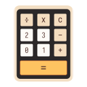

   
  
  <h1>Calculator</h1>

  
A simple calculator for the COSMIC™ desktop

  
  

# History
The calculator has an operations history, providing the ability to bring previous calculations back to the screen for further use or inspection.
